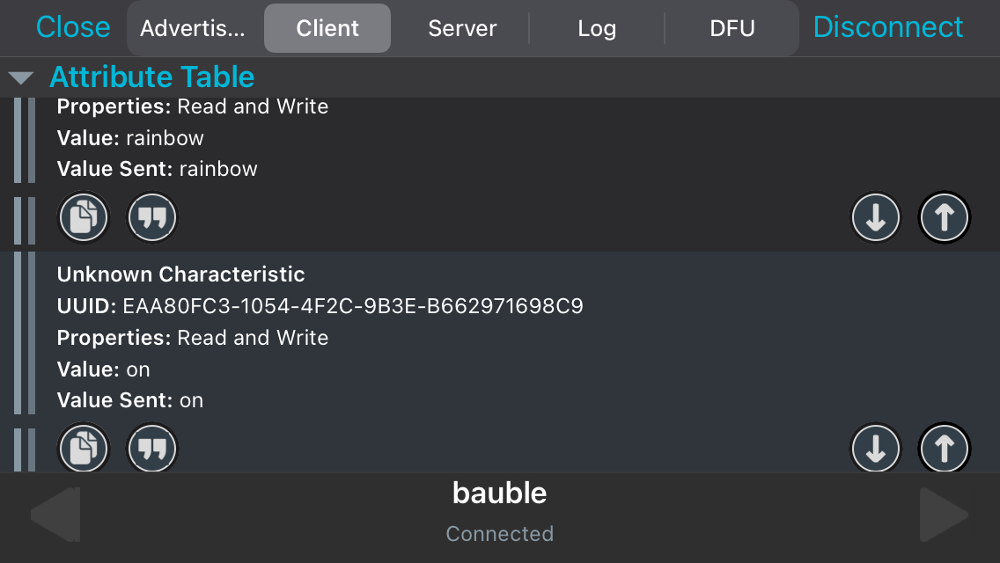

# Christmas bauble

https://github.com/Quang-Tr/Christbaumkugel-Telekom/assets/82781956/86b4664a-71f6-4e14-a2dc-279a29d18e9e

In the CMD+O workshop 2019 of T-Systems (Deutsche Telekom), I have implemented a Bluetooth Low Energy (BLE) communication channel between a smartphone and an ESP32 microcontroller to control some LEDs (for a Christmas bauble 🎄).
After the workshop's end, I have refactored and extended a moderately large amount of code (mainly because I unfortunately lost my original sketch file).

## Components

### Hardware

- ESP32-DevKitC development board
- WS2812b LED strip
- Power source

### Software

- Arduino IDE
  - *esp32* boards by Espressif Systems (then choose board *ESP32 Dev Module* with the correct port)
  - [*Adafruit NeoPixel*](https://github.com/adafruit/Adafruit_NeoPixel) library by Adafruit
- USB to UART bridge VCP driver by Silicon Labs (can be installed as an optional update from Windows Update)
- nRF Connect app or any equivalent for BLE

## Features

Functional BLE service with two characteristics: `ctrl` to turn the LED strip `on` and `off`, and `mode` to switch between six main light orchestration modes.
Sent and received values over BLE are handled in each characteristic's two callback functions, which also consider malformed values.

| `mode`                                                                    | Description                                                                                                       |
|---------------------------------------------------------------------------|-------------------------------------------------------------------------------------------------------------------|
| `red`, `orange`, `yellow`, `green`, `blue`, `indigo`, `violet`, `white`   | Fill the entire strip with one color.                                                                             |
| `allcolors`                                                               | The full strip displays one color after another.                                                                  |
| `bounce`                                                                  | One LED "bounces" from one end to the other end of the strip. When reaching an end, it changes to a random color. |
| `train,` + one predefined color from the first mode (else `white`)        | Groups of LEDs move across the strip.                                                                             |
| `rainbow`                                                                 | All LEDs shift through different hues across the strip (example from NeoPixel).                                   |
| `idle` (the default for unsupported input)                                | The strip brightens in white and then dims.                                                                       |
